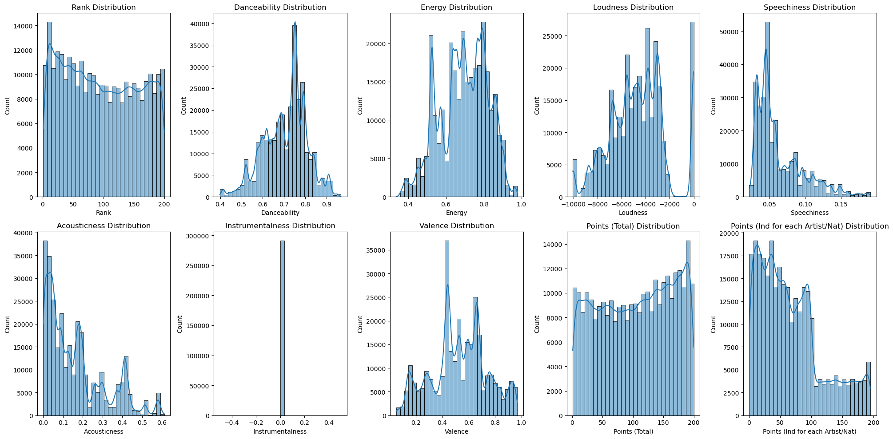
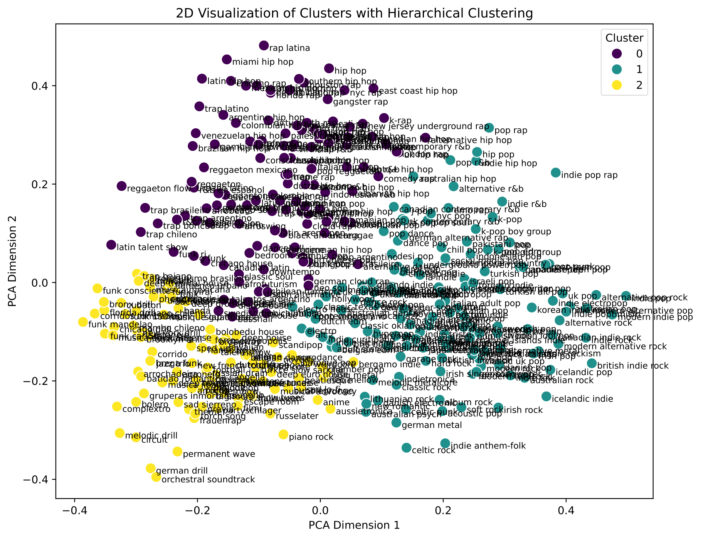

<!DOCTYPE html>
<html>
<head>
<meta charset="utf-8">
</head>
<body>

<h1>Spotify Genre Classification & Trend Analysis</h1>

<b>An end-to-end data pipeline leveraging the Spotify API, web scraping, and machine learning to classify musical genres and analyze popularity trends.</b>

  
  
  
  

  
  

---

<h2>📖 Overview</h2>

This project builds a complete data workflow to collect, enrich, and analyze Spotify music data — from raw metadata extraction to genre classification and trend modeling. It demonstrates real-world skills in <b>data acquisition, preprocessing, NLP, and machine learning</b> by integrating multiple stages into one cohesive system.

---

<h2>🎯 Impact & Motivation</h2>

The music industry produces massive amounts of streaming data, but understanding <b>genre relationships</b> and <b>trends in popularity</b> remains challenging. This project shows how data engineering and ML techniques can turn raw Spotify metadata into actionable insights, such as:

<ul>
  <li>Automatically identifying parent genres from thousands of niche subgenres.</li>
  <li>Analyzing how musical preferences and song popularity evolve over time.</li>
  <li>Exploring semantic relationships between genres using powerful BERT embeddings.</li>
</ul>

---

<h2>⚙️ Project Workflow</h2>

The project is structured as a sequential pipeline, with optional notebooks for deeper analysis.

<ol>
  <li><b>Data Collection</b> ─ <a href="notebooks/spotify_api.ipynb"><code>spotify_api.ipynb</code></a> 
    → Fetches song and artist metadata using the Spotipy library to interact with the Spotify API.</li>

  <li><b>Genre Enrichment</b> ─ <a href="scripts/genre_scrape.py"><code>genre_scrape.py</code></a> 
    → Scrapes parent-genre mappings from <a href="https://www.chosic.com/genre-chart/">chosic.com</a> to create a genre hierarchy.</li>

  <li><b>Genre Classification</b> ─ <a href="notebooks/Final.ipynb"><code>Final.ipynb</code></a> 
    → Cleans the data, engineers features, and trains machine learning models (Random Forest, CatBoost) to predict parent genres from audio features and subgenre names.</li>

  <li><b>(Optional) Time-Series Analysis</b> ─ <a href="notebooks/time_series.ipynb"><code>time_series.ipynb</code></a> 
    → Studies song popularity trends and temporal patterns using models like Prophet and ARIMA.</li>

  <li><b>(Optional) Semantic Encoding</b> ─ <a href="notebooks/BERT_genre_encoder.ipynb"><code>BERT_genre_encoder.ipynb</code></a> 
    → An alternative to web scraping, this notebook uses Sentence-BERT to generate genre embeddings and clusters them to find semantic parent genres.</li>
</ol>

---

<h2>📊 Key Results</h2>
<ul>
  <li><b>Accurate Genre Classification:</b> Achieved <strong>XX.X% F1-score</strong> in predicting parent genres, with CatBoost being the top-performing model.</li>
  <li><b>Data Enrichment at Scale:</b> The web scraping script automatically generated a mapping for over 1,500 unique subgenres to 15 distinct parent genres.</li>
  <li><b>Semantic Genre Clustering:</b> BERT embeddings successfully grouped similar-sounding and culturally related genres, which can be visualized using UMAP for intuitive exploration.</li>
  <li><b>Temporal Trend Insights:</b> Time-series analysis revealed seasonal patterns and long-term shifts in the popularity of different genres.</li>
</ul>

<i>(Detailed results, code, and visualizations are available inside each notebook.)</i>

---

<h2>🛠️ Tech Stack</h2>
<table>
<tr><th>Category</th><th>Tools & Libraries</th></tr>
<tr><td>Data Access & Scraping</td><td>Spotify API (Spotipy), Requests, BeautifulSoup</td></tr>
<tr><td>Data Processing & EDA</td><td>Pandas, NumPy, Matplotlib, Seaborn, Regex</td></tr>
<tr><td>Machine Learning</td><td>Scikit-Learn, CatBoost, XGBoost, UMAP-learn</td></tr>
<tr><td>Deep Learning / NLP</td><td>Sentence-Transformers (BERT), TensorFlow</td></tr>
<tr><td>Time-Series Modeling</td><td>Prophet, Statsmodels</td></tr>
<tr><td>Utilities</td><td>tqdm, Jupyter Notebooks</td></tr>
</table>

---

<h2>📂 Repository Structure</h2>
<pre>
spotify-genre-analysis/
 ┣ 📂 assets/
 ┃ ┣ image1.png
 ┃ ┗ image2.png
 ┣ 📂 notebooks/
 ┃ ┣ spotify_api.ipynb
 ┃ ┣ Final.ipynb
 ┃ ┣ time_series.ipynb
 ┃ ┗ BERT_genre_encoder.ipynb
 ┣ 📂 scripts/
 ┃ ┗ genre_scrape.py
 ┣ 📂 data/
 ┃ ┣ output_with_genres.csv
 ┃ ┗ parent_genre.csv
 ┣ .gitignore
 ┣ requirements.txt
 ┗ README.md
</pre>

---

<h2>🚀 Getting Started</h2>

<h3>Prerequisites</h3>
<ul>
  <li>Python 3.7+</li>
  <li>Git</li>
</ul>

<h3>1. Clone the Repository</h3>
<pre><code>git clone https://github.com/yourusername/spotify-genre-analysis.git
cd spotify-genre-analysis</code></pre>
<h3>2. Install Dependencies</h3>

Install all the required libraries using the <code>requirements.txt</code> file.

<pre><code>pip install -r requirements.txt</code></pre>

<h3>3. Configure Spotify API Credentials</h3>

To fetch data from Spotify, you need to provide your own API credentials:

<ol>
  <li>Go to the <a href="https://developer.spotify.com/dashboard/">Spotify Developer Dashboard</a> and create a new application.</li>
  <li>Note down your <b>Client ID</b> and <b>Client Secret</b>.</li>
  <li>Open <code>notebooks/spotify_api.ipynb</code> and paste your credentials into the designated cells.</li>
</ol>

<h3>4. Run the Main Pipeline</h3>

Execute the scripts and notebooks in the following order:

<pre><code># Step 1: Fetch Spotify metadata
jupyter notebook notebooks/spotify_api.ipynb

# Step 2: Scrape parent genres
python scripts/genre_scrape.py

# Step 3: Analyze and classify genres
# IMPORTANT: In this notebook, remember to set the `categorical_encoding`
# variable to your desired method at the beginning of Task 1.
jupyter notebook notebooks/Final.ipynb
</code></pre>

<h3>5. Run Optional Analyses</h3>

To explore trend analysis or semantic genre clustering, run the supplementary notebooks:

<pre><code># For time-series analysis
jupyter notebook notebooks/time_series.ipynb

# For semantic genre clustering with BERT
jupyter notebook notebooks/BERT_genre_encoder.ipynb
</code></pre>

---

<h2>🤝 Contributing</h2>

Contributions are welcome! If you have suggestions for improvements or find any issues, please feel free to open an issue or submit a pull request.

---

<h2>📄 License</h2>

This project is licensed under the MIT License. See the <a href="LICENSE">LICENSE</a> file for more details.

---

<h2>👤 Authors</h2>

  <b>Álvaro Garabal Castro, Marc Camps, Ankur Chauhan, Serkan Musellim</b> 
  🎓 MSc in Artificial Intelligence, University of Edinburgh 
  🔗 <a href="https://www.linkedin.com/in/alvarogarabal">LinkedIn</a> • 
  <a href="https://github.com/alvarogarabal">GitHub</a>

</body>
</html>

